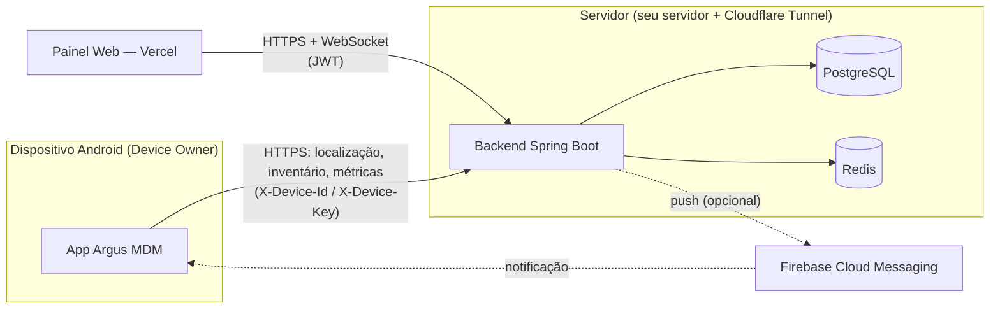

# Argus MDM

Plataforma completa de Mobile Device Management (MDM) para dispositivos Android
próprios ou corporativos, com autorização explícita do proprietário: inventário,
localização, políticas de segurança e gerenciamento remoto.

> Este projeto gerencia dispositivos com consentimento de quem os usa. O app Android
> sempre exibe um aviso permanente e visível de que o dispositivo está gerenciado —
> não há coleta oculta.

## Componentes

| Componente | Stack | Pasta |
|---|---|---|
| Backend | Java 21, Spring Boot 3, PostgreSQL, Redis, WebSocket | [`backend/`](backend) |
| Painel web | React, TypeScript, Tailwind, shadcn/ui, React Query | [`frontend/`](frontend) |
| App Android | Kotlin, MVVM, Hilt, Room, WorkManager, Jetpack Compose | [`android/`](android) |

## Arquitetura



Veja [`docs/architecture.md`](docs/architecture.md) para o detalhamento de cada camada
(Clean Architecture no backend, MVVM no Android) e o modelo de dados completo.

## Deploy

Guia passo a passo para o cenário deste projeto — backend em servidor próprio
(Windows + Docker) exposto via Cloudflare Tunnel, frontend no Vercel:

**[`docs/deploy-servidor-proprio.md`](docs/deploy-servidor-proprio.md)**

## Desenvolvimento local

```bash
# Backend (requer Postgres e Redis rodando — veja backend/README ou use Docker)
cd backend && mvn spring-boot:run

# Frontend
cd frontend && npm install && npm run dev

# Android — abra a pasta android/ no Android Studio
```

Cada módulo tem seu próprio guia:
- [`backend/`](backend) — Swagger em `/swagger-ui.html`, testes com `mvn clean verify`
- [`frontend/`](frontend) — `npm run build` para produção
- [`android/README.md`](android/README.md) — build, instalação como Device Owner e provisionamento

## API

Documentação interativa (Swagger/OpenAPI) em `/swagger-ui.html` quando o backend está
rodando. Coleção Postman pronta em [`docs/postman/`](docs/postman).

## CI

GitHub Actions valida build e testes de cada componente a cada push/PR — veja
[`.github/workflows/`](.github/workflows). O deploy em si é manual (guia acima), já
que o backend roda em um servidor próprio, não em um provedor com deploy automático.
